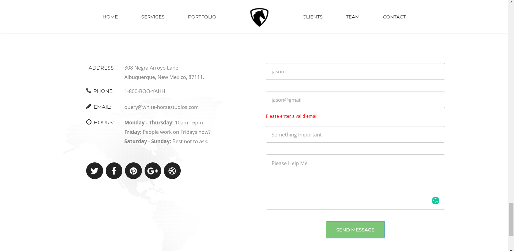

# White-Horse-Template

            

White-Horse is a free to use Bootstrap template.

This template uses the default Bootstrap 4 styles along with a variety of powerful jQuery plugins and tools to create a

Basic HTML Template.

## Theme Demo

## Contact Form

This Theme Include a Basic Contact Form With Jquery Validation. Having Input Fields Name, Email, Mobile Number, Subject and Message.

 
### Contact Form Preview

## Theme Details

White-Horse is a Basic HTML Template with Bootstrap Included. It is a one page Theme does not contain multiple pages. It is very Basic and Classy Template made by our Team.

## Contributing

Pull requests are welcome. For major changes, please open an issue first to discuss what you would like to change.
  
## Scripts included:

* Bootstrap  

* Font Awesome

* jQuery

* Validator - HTML Form Validator using jQuery
 
## Updates

### Update 1.0.0

* Template Generated

### Update 1.0.1
* Jquery Form Validation Included in Contact Form
* Mobile Number Field Inserted in Contact Form
* Readme Updated